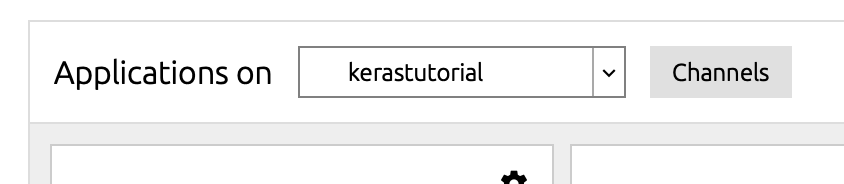
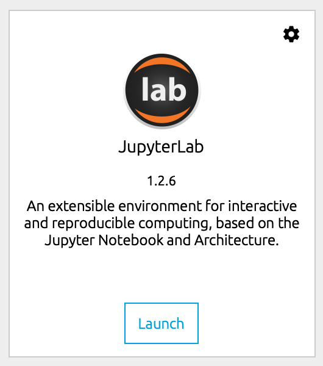
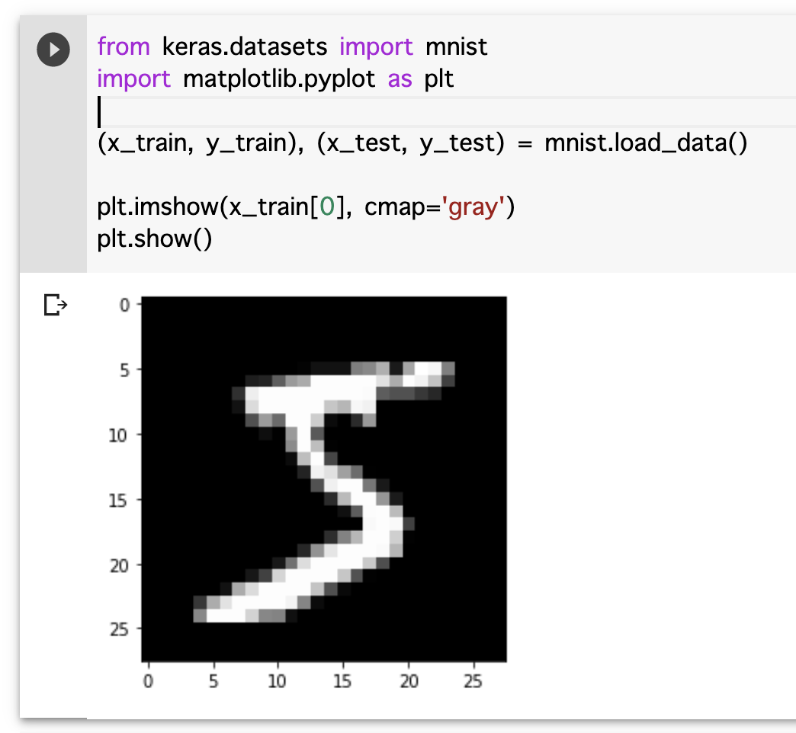

# Keras入門

## Anaconda3 へのパスを通す

conda init を実行しましょう。 zshの人はzsh。bashの人はbash

## NotWritableError が出る人へ

インストールディレクトリの権限が不足している恐れがあります。 https://qiita.com/richardf/items/5106e2000c8fe71d10 で解決を図ってください

## 仮想環境を作る

```
$ conda create --name kerastutorial python=3.6
$ conda activate kerastutorial
```

## Anaconda Navigator のセットアップ

Anaconda Navigator を起動し、 Application on を kerastutorial に変更する。



## JupyterLab のインストール

Anaconda Navigator を使って JupyterLab を起動する



http://localhost:8888/lab へ接続する


## Keras の実行確認

https://keras.io/#getting-started-30-seconds-to-keras のコードを実行する。

```
from keras.models import Sequential

model = Sequential()
```


Shift+Enter を押してエラーが出なかったらOK。もし、モジュールがないと言われた場合は、 Anaconda Navigator の Application on が kerastutorial になっているか確認する。

## 機械学習の始め方

私の主観ですが、こんな印象です。モデル構築以外の工程が多い。いきなり「機械学習で解決しましょう！」となることは多くない。機械学習プロジェクトの初期フェーズでは、予算が少ない場合が多く、少人数で広範なタスクを要求され、泥臭さが伴う。

1. PoC（実証実験）
  1. 要件定義
  1. 期限と目標を定める（撤退ライン）
  1. データを集めてくる
  1. データから不要なデータを削る
  1. データを加工する
  1. データの傾向を知る
  1. モデルを構築する
  1. モデルをチューニングする
  1. プレゼンテーション
1. 本番への試験導入
  1. 要件定義
  1. アーキテクチャ設計
  1. 運用設計
  1. 実装
  1. 運用

## 無意味な予測を Keras で行って流れを掴む

ここで扱うのは、全く無意味の予測である。データの特徴を考える必要がないので、コードの流れに集中できる。

### 2値分類を行う

```
from keras.models import Sequential
from keras.layers import Dense, Activation

model = Sequential()
model.add(Dense(32, activation='relu', input_dim=100))
model.add(Dense(1, activation='sigmoid'))
model.compile(optimizer='rmsprop',
              loss='binary_crossentropy',
              metrics=['accuracy'])

# ダミーデータ
import numpy as np
data = np.random.random((1000, 100))
labels = np.random.randint(2, size=(1000, 1))

# モデルの学習。32サンプルずつ取り出して学習する
# サンプル数(batch_size)が増えれば増えるほど、高速に学習が終わるが学習がうまく進まない可能性がある
history = model.fit(data, labels, epochs=10, batch_size=32)

# 乱数を入力にして予測をさせる
model.predict(np.random.random((1, 100)))
# 出力例:
# array([[0.48207587]], dtype=float32)
```

`history` の中には学習時パラメーターや、損失値と正確度(正確性,正解率)が記録されている。

### 2値分類の学習の様子を可視化する

`!conda install matplotlib -y` を実行し、 [matplotlib](https://matplotlib.org/) は作図ライブラリのデファクトスタンダードである。

以下のコードを実行すると、EpochごとのAccuracyの遷移が確認できる。

```
%matplotlib inline
import matplotlib.pyplot as plt
 
plt.plot(range(1, history.params['epochs']+1), history.history['acc'], label="Accuracy")
plt.xlabel('Epochs')
plt.ylabel('Accuracy')
plt.legend()
plt.show()
```

もし、以下のようなメッセージが表示されてしまった場合はメモリ不足が原因である可能性がある。CNNはメモリ使用量が多いため、OOMキラーに殺されてしまうことがある。この場合は、ローカルでの実行を諦めて [Google Colaboratory](https://colab.research.google.com/) に移動するのが良い。

```
Kernel Restarting
The kernel for Untitled.ipynb appears to have died. It will restart automatically.
```

#### 作図ライブラリについて

最近は、Plotlyが注目を集めている。[令和時代のPython作図ライブラリのデファクトスタンダードPlotlyExpressの基本的な描き方まとめ](https://qiita.com/hanon/items/d8cbe25aa8f3a9347b0b) という記事に他のライブラリとの比較が書いてある。ほかの有名な作図ライブラリには、 [seaborn](https://seaborn.pydata.org/) がある。


#### 正確度（正確性,正解率）と精度（再現性）の違いについて

真値への近さのことを正確度(accuracy)という。ばらつきの小ささのことを精度(precision)という。

詳細 https://www.hitachi-hightech.com/jp/products/device/semiconductor/accuracy-precision.html

#### 正確度（正確性,正解率)の問題

正確度だけを見ていればいいのではないか？と考える人は多いが、それはときとして問題になる。

とある広告を与えられたユーザーがクリックするモデルを構築するときを考える。ユーザーが広告をクリックする確率は、0.1%であるとする。

太郎が作成したモデルは、99.9%の正確度(accuracy)を記録した。そのモデルの中身を見てみると、どんなデータであってもクリックしないと判定するロジックになっていた。これが正確度だけで判断してはいけない理由である。

[【入門者向け】機械学習の分類問題評価指標解説(正解率・適合率・再現率など)](https://qiita.com/FukuharaYohei/items/be89a99c53586fa4e2e4) にわかりやすく書いてある。

### 演習: lossを可視化する

さきほどは、正確度(acc)がEpochが進むごとにどのように上がっていくか可視化した。損失(loss)がどのように減っていくか可視化する。

```
%matplotlib inline
import matplotlib.pyplot as plt
 
plt.plot(range(1, history.params['epochs']+1), history.history['????????'], label="????????")
plt.xlabel('Epochs')
plt.ylabel('????????')
plt.legend()
plt.show()
```

機械学習でよくみる結果が生成できる。

### Optional: TensorBoard

上では学習の変遷を matplotlib で可視化した。[TensorBoard](https://www.tensorflow.org/tensorboard) というライブラリを使えばリアルタイムに学習の様子を可視化できる。

- [Using TensorBoard in Notebooks](https://www.tensorflow.org/tensorboard/tensorboard_in_notebooks)
- [TensorBoardを使ってみる（v1.13.1）](https://blog.imind.jp/entry/2019/08/10/031949)

## loss と optimizer は何か？

```
model.compile(optimizer='rmsprop',
              loss='binary_crossentropy',
              metrics=['accuracy'])
```

lossとは学習時にモデルがどれくらい間違っているか（正確性が低いか）を表す値。Lossは損失関数(loss function)によって算出される。

機械学習は、このLossが最小化するように学習が進行する。Lossが減少しない場合、損失関数が不適切であったり、オプティマイザが不適当な場合がある。

損失関数はいくつも選択肢がありタスクによって選ばれる。2値分類の場合は、 binary_crossentropy を利用する。3値以上の分類では、 categorical_crossentropy か、sparse_categorical_crossentropy を用いる。そのほかの代表的な損失関数は[損失関数の利用方法](https://keras.io/ja/losses/)にまとまっている。

オプティマイザ(optimizer)は、Lossと現在のモデルから次のモデルをどのように変更するか更新を担当している。[オプティマイザ（最適化アルゴリズム）の利用方法](https://keras.io/ja/optimizers/)に代表的なものがまとまっている。数式と簡単なまとめについては [Optimizer : 深層学習における勾配法について](https://qiita.com/tokkuman/items/1944c00415d129ca0ee9) を参照。

オプティマイザの動き方については、 [Jaewan-Yun/optimizer-visualization](https://github.com/Jaewan-Yun/optimizer-visualization) を見るとなんとなく理解できるかもしれない。オプティマイザは関数の最小値を探すための更新ロジック。オプティマイザごとに最小値を探すときの動き方が異なる。当然、解こうとしている問題によって適しているオプティマイザは異なる。

## model とは何か？

ニューラルネットワークは、基本的にレイヤーで作成されている。 `model.add` によってレイヤーを追加できる。レイヤーは入力データから、レイヤーはそれぞれパラメーターを持っており、オプティマイザによってモデルのパラメーターが更新される。

このパラメーターをざっくり言うと入力データの「表現」である。この「表現」が出力にとって意味をもつことが期待される。「良い経験」とも言えるかもしれない。

```
model = Sequential()
model.add(Dense(32, activation='relu', input_dim=100))
model.add(Dense(1, activation='sigmoid'))
```

今回の話では、すべてシーケンシャルなモデルを扱う。シーケンシャルではないモデルの例としては、 [U-net](https://arxiv.org/abs/1505.04597) などがあり、レイヤーがシーケンシャル(一列)ではなく、複数のレイヤーのレイヤーに接続されているようになっている。複雑なタスクでは、シーケンシャルなモデル以外が用いられることがある。Keras で複雑なモデルをどう書くかについては [KerasでU-Netを実装してみる](https://www.oki-lab.net/entry/2019/09/23/091044) が参考になるかもしれない。

シーケンシャルなモデルであれば、 `model.add` でレイヤーをシンプルに重ねるだけなので可読性が高い。

### レイヤー

レイヤーにはいくつも種類がある。日本語ドキュメントは情報がかなり欠落しているのおすすめしない。頻繁に活用するのは、以下の3つ。

- [Core Layers](https://keras.io/layers/core/)
- [Convolutional Layers](https://keras.io/layers/convolutional/)
- [Pooling Layers](https://keras.io/layers/pooling/)

さきほどの例では、Denseレイヤーを用いている。これは全結合層と呼ばれ、ニューラルネットワークの最も原始的な形である。

各レイヤーの訳語は次のように対応することが多いので、踏まえた上で [畳み込みニューラルネットワーク_CNN(Vol.16)](https://products.sint.co.jp/aisia/blog/vol1-16) の説明を読むとよい。

- Dense Layers: 全結合層
- Convolutional Layers: 畳み込み層
- Pooling Layers: プーリング層

さきほどの例を読み解くと、入力次元を100次元とする全結合層で中間層が32次元になる。最終的には1次元のベクトルが出力される。

```
model.add(Dense(32, activation='relu', input_dim=100)) # レイヤーをモデルに追加
model.add(Dense(1, activation='sigmoid')) # レイヤーをモデルに追加
```

### レイヤーの決め方

どのレイヤーをどのタイミングで使うかは、ある程度基本があるが、私の知る範囲では経験則に依るものが大きい。初心者がレイヤー設計をするのはかなり困難なので、すでにあるモデルを活用するのがおすすめである。

GCPの [Cloud AutoML](https://cloud.google.com/automl/) では、自動的にネットワーク構造（レイヤー構造）を決定する理論が使われている。その技術は、 Neural Architecture Search と呼ばれている。[AutoMLの理論、Neural Architecture Searchを説明する](https://qiita.com/cvusk/items/536862d57107b9c190e2) に詳しい。

## activation とは何か？

activation は活性化関数と呼ばれ、どのような関数値で次のノードに伝搬するのか決定する。たとえば、よく使われる `relu` 関数は入力値xが0以下なら0。0より大きい場合は、xを出力するような関数である。[relu関数詳細](https://www.wolframalpha.com/input/?i=relu)

もし、activationが `lambda x: 0` というような常に0を出力する関数の場合は何も出力されないために学習が進まない。

活性化関数の詳細は、[活性化関数 出典: フリー百科事典『ウィキペディア（Wikipedia）』](https://ja.wikipedia.org/wiki/%E6%B4%BB%E6%80%A7%E5%8C%96%E9%96%A2%E6%95%B0#ReLU%EF%BC%88%E3%83%A9%E3%83%B3%E3%83%97%E9%96%A2%E6%95%B0%EF%BC%89) に詳しい。

よく使われるものとして以下が挙げられる。

- ReLU
- Sigmoid
- tanh

## Kerasのデータセットで実際にディープラーニングを行う

機械学習を行うときは、データが必ず必要になる。Kerasには、ベンチマークの対象になるデータセットが同梱されている。今回は、ど定番の mnist を試してみる。 mnist は0-9の数字が1画像あたり、1文字書かれている手書き数字のデータセットである。

https://keras.io/ja/datasets/#mnist

機械学習では、学習用データを **train** 、テスト用データを **test** と慣例的に表現する。**x** は入力、**y** は出力を表す。つまり、 **x_train** は学習用入力データ、 **y_test** はテスト用出力データを表す。

合計値を予測するモデルを構築するためのデータがあったとすれば、x に `[1, 2, 3]` が入っており、 y に `6` が入るようなものである。

```
from keras.datasets import mnist

(x_train, y_train), (x_test, y_test) = mnist.load_data()
```

### データを見てみる

x_train, y_train, x_test, y_test のどれも、28x28のグレー画像たちが入っている。 `x_train[0]` という形でアクセスし、 `matplotlib` を使って可視化できる。

```
from keras.datasets import mnist
import matplotlib.pyplot as plt

(x_train, y_train), (x_test, y_test) = mnist.load_data()

plt.imshow(x_train[0], cmap='gray')
plt.show()
```



### CNN を実際に動かす

以下のコードで実際にCNNを構築する。

```
from keras.models import Sequential
from keras.layers import Dense, Dropout, Flatten
from keras.layers import Conv2D, MaxPooling2D

model = Sequential()
model.add(Conv2D(32, kernel_size=(3, 3), activation='relu', input_shape=(28, 28, 1))) # input_shapeは 画像サイズに準ずる
model.add(Conv2D(64, kernel_size=(3, 3), activation='relu'))
model.add(MaxPooling2D(pool_size=(2, 2)))
model.add(Dropout(0.25)) # 過学習を防ぐために、ノードからの伝搬を確率的に落とす
model.add(Flatten())
model.add(Dense(128, activation='relu'))
model.add(Dropout(0.5)) # 過学習を防ぐために、ノードからの伝搬を確率的に落とす
model.add(Dense(10, activation='softmax')) # 10次元ベクトル。各値は0〜1である
```

modelは、シーケンシャルなネットワークになっている。modelのネットワークをわかりやすく表示する `summary()` 関数を使ってみる。

```
model.summary()
```

以下のような、出力が得られる。各レイヤーの名前や形状、パラメーター数が確認できる。
このモデルはこれだけ短いコードであっても、 **1,199,882** のパラメーターが存在する。

```
Model: "sequential_1"
_________________________________________________________________
Layer (type)                 Output Shape              Param #   
=================================================================
conv2d_1 (Conv2D)            (None, 26, 26, 32)        320       
_________________________________________________________________
conv2d_2 (Conv2D)            (None, 24, 24, 64)        18496     
_________________________________________________________________
max_pooling2d_1 (MaxPooling2 (None, 12, 12, 64)        0         
_________________________________________________________________
dropout_1 (Dropout)          (None, 12, 12, 64)        0         
_________________________________________________________________
flatten_1 (Flatten)          (None, 9216)              0         
_________________________________________________________________
dense_1 (Dense)              (None, 128)               1179776   
_________________________________________________________________
dropout_2 (Dropout)          (None, 128)               0         
_________________________________________________________________
dense_2 (Dense)              (None, 10)                1290      
=================================================================
Total params: 1,199,882
Trainable params: 1,199,882
Non-trainable params: 0
_________________________________________________________________
```

Non-trainable params が0となっている。これはすべての重みを学習させることを表している。学習では特定レイヤーをフリーズする（学習させない）ことができる。学習させないことで、次回の学習を短時間で終えることができる。フリーズは、 fine tuning(≒転移学習) のときによく使われる。

Keras の公式に [fine-tuningの例](https://keras.io/ja/applications/#fine-tune-inceptionv3-on-a-new-set-of-classes) が載っている。

fine tuningや転移学習の詳細は次の資料を参照。

- [Building powerful image classification models using very little data](https://blog.keras.io/building-powerful-image-classification-models-using-very-little-data.html)
- [Kaggle Facial Keypoints DetectionをKerasで実装する](https://elix-tech.github.io/ja/2016/06/02/kaggle-facial-keypoints-ja.html#transfer)

# 動作させる

```python
import keras
from keras.datasets import mnist
from keras.models import Sequential
from keras.layers import Dense, Dropout, Flatten
from keras.layers import Conv2D, MaxPooling2D
from keras import backend as K

batch_size = 128
num_classes = 10
epochs = 12

img_rows, img_cols = 28, 28

# 学習用とテスト用に分離する
(x_train, y_train), (x_test, y_test) = mnist.load_data()

# n, height, width, 1 の形式に変換
x_train = x_train.reshape(x_train.shape[0], img_rows, img_cols, 1)
x_test = x_test.reshape(x_test.shape[0], img_rows, img_cols, 1)
input_shape = (img_rows, img_cols, 1)

# 学習を安定させるために最小値0, 最大値1に正規化
x_train = x_train.astype('float32')
x_test = x_test.astype('float32')
x_train /= 255
x_test /= 255
print('x_train shape:', x_train.shape)
print(x_train.shape[0], 'train samples')
print(x_test.shape[0], 'test samples')

# one hotベクトルへの変換
# ベクトルのうち、1つだけが1でほかが0であるようなベクトルのこと。今回はsoftmaxを使うため。
# see: https://qiita.com/JeJeNeNo/items/8a7c1781f6a6ad522adf
y_train = keras.utils.to_categorical(y_train, num_classes)
y_test = keras.utils.to_categorical(y_test, num_classes)

model = Sequential()
model.add(Conv2D(32, kernel_size=(3, 3),
                 activation='relu',
                 input_shape=input_shape))
model.add(Conv2D(64, (3, 3), activation='relu'))
model.add(MaxPooling2D(pool_size=(2, 2)))
model.add(Dropout(0.25))
model.add(Flatten())
model.add(Dense(128, activation='relu'))
model.add(Dropout(0.5))
model.add(Dense(num_classes, activation='softmax'))

model.compile(loss=keras.losses.categorical_crossentropy,
              optimizer=keras.optimizers.Adadelta(),
              metrics=['accuracy'])

# テスト用のデータでモデルの正確度を確かめる
model.fit(x_train, y_train,
          batch_size=batch_size,
          epochs=epochs,
          verbose=1,
          validation_data=(x_test, y_test))
score = model.evaluate(x_test, y_test, verbose=0)
print('Test loss:', score[0])
print('Test accuracy:', score[1]) # 99%超え
```

## 学習したモデルを試してみる

以下のURLから、**6** と書かれた画像をダウンロードして実際に推定する。 `curl` が使えない場合はURLにアクセスしてダウンロード。ここでダウンロードするデータは、学習時に含まれていない画像である。

```sh
!curl 'https://placehold.jp/24/000000/ffffff/28x28.png?text=6' -o six.png
```

ダウンロードしたファイルがどんな見た目になっているか調べる。

```python
from matplotlib import image
image = image.imread('six.png')
plt.imshow(image, cmap='gray')
```


ダウンロードした数字をモデルから推論してみる。

```
# 入力の形状は原則 (n, height, width, 1) になる
images = image.reshape(1, img_rows, img_cols, 1)
result = model.predict(images)
result
```

resultの中には連想配列が入るため、この中の数値は確からしさを表している。もっとも確からしさが高いインデックスが、推論結果とみなせる。

```
array([[1.0205811e-03, 6.8330079e-09, 3.4062857e-06, 3.1529291e-04,
        2.4643386e-08, 7.1315593e-01, 1.4781141e-01, 4.9041478e-08,
        1.3623212e-01, 1.4611568e-03]], dtype=float32)
```

確からしさの高いインデックスを調べるには、numpyの `argmax` を使う。インデックスは0から始まるので+1すれば数字と一致する。

```
import numpy as np
np.argmax(result[0])+1 # 結論
# 6!
```

## 自由課題

- どんなデータセットが Keras に用意されているか？
- [Applications](https://keras.io/applications/) にたくさんのすでに構築済みのモデルが置いてある。それぞれどんなものか調べる
- パラメーターを変更して結果がどのように変わるか、実際にやってみる
- ほかに28x28の画像を用意してどのように結果が変わるか見てみる